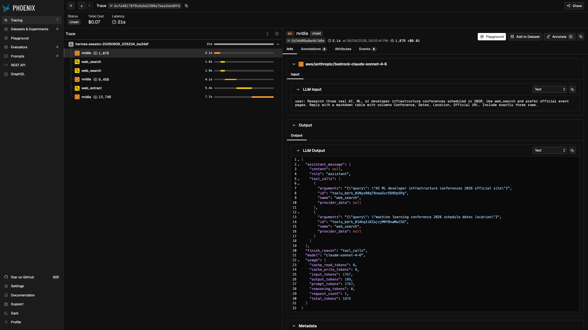
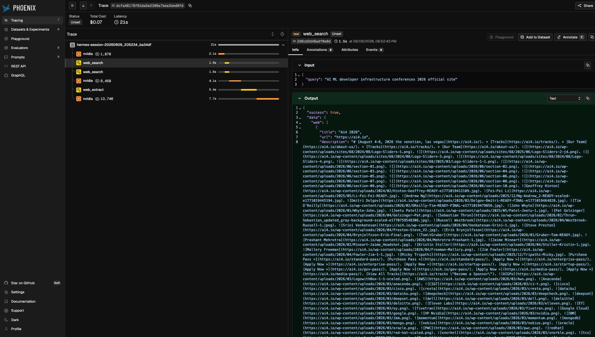
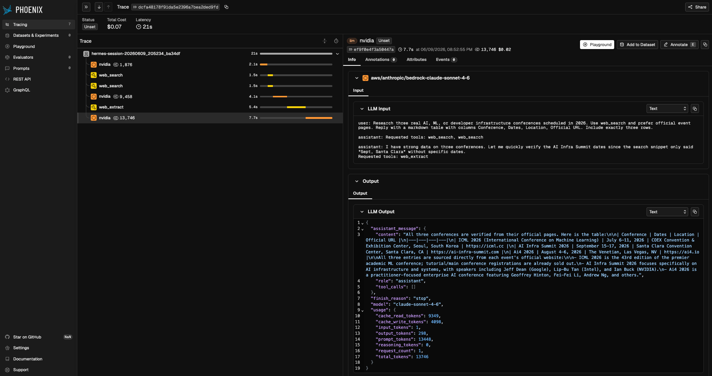

# Hermes Agent Observability with NeMo Relay

Run Hermes Agent with the built-in NeMo Relay plugin and inspect ATOF, ATIF,
and OpenInference traces in Phoenix.

This demo keeps Hermes in control of the agent loop, model provider setup,
tools, and CLI UX. NeMo Relay observes the LLM and tool boundaries through the
canonical `plugins.toml` path.

`run.sh` creates an isolated Hermes home for each run, enables the bundled
`observability/nemo_relay` plugin in that generated config, writes a NeMo Relay
`plugins.toml`, and points Hermes at it with `HERMES_NEMO_RELAY_PLUGINS_TOML`.
You do not need to modify your normal `~/.hermes` config or run
`hermes plugins enable` for this demo.

## Quickstart

This demo expects a local Hermes Agent checkout with the bundled
`observability/nemo_relay` plugin and the `nemo-relay` Python package installed
in the Hermes environment. If you already have that setup, skip to the demo
setup below.

Create the sibling checkout layout:

```bash
mkdir -p hermes-nemo-relay-workspace
cd hermes-nemo-relay-workspace

git clone https://github.com/NousResearch/hermes-agent.git
git clone https://github.com/mnajafian-nv/hermes-nemo-relay-demo.git
```

Use the current Hermes `main` branch. It includes the one-shot cleanup behavior
needed for the demo to flush observability artifacts at the end of a
non-interactive run.

Install Hermes Agent:

```bash
cd hermes-agent
uv venv venv --python 3.11
source venv/bin/activate
uv pip install -e ".[all]"
cd ..
```

Install NeMo Relay into the Hermes environment:

```bash
cd hermes-agent
source venv/bin/activate
uv pip install nemo-relay
cd ..
```

If `nemo_relay` is not importable from the Hermes Python environment, the script
exits with a setup error before running the model.

Demo setup:

```bash
cd hermes-nemo-relay-demo
cp keys.env.example keys.env
chmod 600 keys.env
```

Edit `keys.env` and add your keys:

```bash
HERMES_DEMO_PROVIDER=nvidia
NVIDIA_API_KEY=replace-with-your-nvidia-inference-key
TAVILY_API_KEY=replace-with-your-tavily-key
```

You can also set `HERMES_DEMO_PROVIDER=anthropic` with `ANTHROPIC_API_KEY`,
or `HERMES_DEMO_PROVIDER=openai` with `OPENAI_API_KEY`. You only need one
model-provider key for the provider you pick.

Run the demo:

```bash
./run.sh
```

By default, `./run.sh` runs the best visual web-search walkthrough for the
provider you selected. Use `./run.sh all` only when you want to compare every
request family supported by that provider.

Open Phoenix:

```text
http://127.0.0.1:6006/projects
```

## Commands

| Command | What it runs | Best use |
| --- | --- | --- |
| `./run.sh` | Web-search demo on the selected provider's default lane | Best live walkthrough |
| `./run.sh all` | Web-search demo across supported lanes | Request-family comparison |
| `./run.sh messages` | `/v1/messages` | NVIDIA or Anthropic |
| `./run.sh chat` | `/v1/chat/completions` | NVIDIA or OpenAI |
| `./run.sh responses` | `/v1/responses` | NVIDIA or OpenAI |

The script starts or reuses Phoenix and creates one project per selected lane:

```text
nemo-relay-hermes-demo-<run-id>-<lane>
```

## What This Proves

- Hermes emits observability through the bundled `observability/nemo_relay`
  plugin.
- NeMo Relay receives the LLM and tool boundary events through `plugins.toml`.
- ATOF JSONL is written for LLM and tool lifecycle events.
- ATIF trajectory JSON is written for the agent run.
- OpenInference traces reach Phoenix and show the Hermes LLM/tool tree.
- The NVIDIA path can exercise `/v1/messages`, `/v1/chat/completions`, and
  `/v1/responses`.
- The Anthropic path exercises `/v1/messages`.
- The OpenAI path exercises `/v1/chat/completions` and `/v1/responses`.

Cost is provider-payload gated. If the provider returns explicit cost fields,
Relay surfaces them. If the provider returns usage tokens only, the artifacts
show usage and Phoenix may estimate display cost depending on its model rules.

## Explore More

Hermes can use NeMo Relay to export the same run in three useful views:

- ATOF raw event logs for debugging
- ATIF trajectory files for replay and evaluation
- OpenInference traces for Phoenix or any compatible OTLP/OpenInference backend

The captured data can include session, tool, subagent, and LLM/provider lifecycle
events across Anthropic `/v1/messages`, OpenAI-compatible
`/v1/chat/completions`, and OpenAI/OpenAI-compatible `/v1/responses` when
those Hermes provider paths are configured. Usage and cost are preserved when
the provider payload includes them.

## Prerequisites

- Local Hermes Agent checkout with a working virtual environment and the bundled
  `observability/nemo_relay` plugin.
- NeMo Relay installed in the Hermes environment.
- Docker for Phoenix.
- `curl` on `PATH`.
- One model-provider key: NVIDIA Inference, Anthropic, or OpenAI.
- Tavily key.

The default sibling-checkout layout is:

```text
<workspace>/
  hermes-agent/
  hermes-nemo-relay-demo/
```

If your Hermes checkout is in a different location, set this in `keys.env`:

```bash
HERMES_REPO=/path/to/hermes-agent
```

## Provider Setup

Pick one provider in `keys.env`:

```bash
HERMES_DEMO_PROVIDER=nvidia
NVIDIA_API_KEY=replace-with-your-nvidia-inference-key
TAVILY_API_KEY=replace-with-your-tavily-key
```

For Anthropic:

```bash
HERMES_DEMO_PROVIDER=anthropic
ANTHROPIC_API_KEY=replace-with-your-anthropic-key
TAVILY_API_KEY=replace-with-your-tavily-key
```

For OpenAI:

```bash
HERMES_DEMO_PROVIDER=openai
OPENAI_API_KEY=replace-with-your-openai-key
TAVILY_API_KEY=replace-with-your-tavily-key
```

Provider defaults:

| Provider | Default model | Supported lanes |
| --- | --- | --- |
| `nvidia` | `aws/anthropic/bedrock-claude-sonnet-4-6` | `messages`, `chat`, `responses` |
| `anthropic` | `claude-sonnet-4-6` | `messages` |
| `openai` | `gpt-4.1` | `chat`, `responses` |

If your account does not have access to the default model, set the matching
override in `keys.env`: `NVIDIA_MODEL_ID`, `ANTHROPIC_MODEL_ID`, or
`OPENAI_MODEL_ID`.

Keep `keys.env` private. Generated outputs can contain prompts, model
responses, traces, and provider metadata.

## Advanced Overrides

The defaults assume the sibling checkout layout documented above and Phoenix on
port `6006`. If needed, set these in `keys.env`:

```bash
HERMES_REPO=/path/to/hermes-agent
PHOENIX_UI_PORT=6007
```

## Inspect Results

For a quick walkthrough in Phoenix:

1. Open `http://127.0.0.1:6006/projects`.
2. Select the generated `nemo-relay-hermes-demo-<run-id>-<lane>` project.
3. Open the trace.
4. Show the trace tree with LLM spans and tool spans.
5. Select an LLM span and show input, output, usage, latency, and cost.

## Phoenix Walkthrough

The trace tree shows Hermes running normally while NeMo Relay records the LLM
and tool boundaries:



Tool spans show the Tavily-backed web search calls that Hermes made during the
run:



LLM spans show the prompt, model output, usage, latency, and cost metadata:



For local artifacts:

```text
outputs/<run-id>/<lane>/atof/events.jsonl
outputs/<run-id>/<lane>/atif/*.json
outputs/<run-id>/<lane>/nemo-relay/plugins.toml
outputs/<run-id>/<lane>/hermes-home/config.yaml
outputs/<run-id>/<lane>/logs/hermes.log
outputs/<run-id>/<lane>/summary.txt
```
